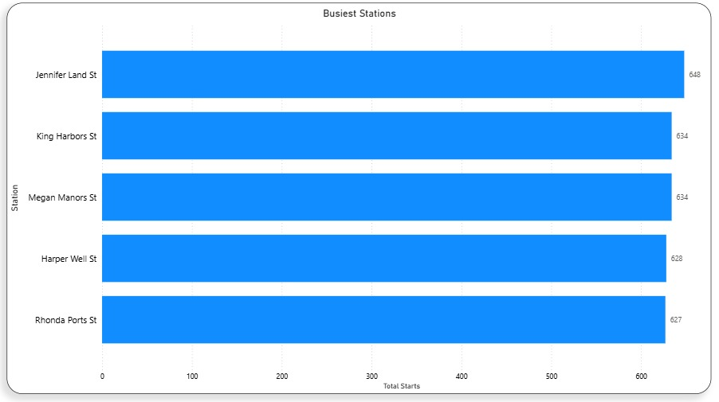

# Advanced SQL Analytics for Urban Bike-Sharing: CTEs, Window Functions & Time Series

## Project Background

An urban bike-sharing platform designed for short-distance commuting and casual city travel. The system operates in a high-frequency mobility environment where growth, retention, and operational efficiency are closely linked to user behavior and station availability.

This project applies SQL-based analytics to ride-level, user-level, and station-level data to answer key business and operational questions commonly faced by shared mobility platforms.

---

## Analysis Framework

Each section follows a structured analytics flow:

**Business Question → Insight → Recommendation → Visual**

## Useful links

- You can access the SQL queries used for **Data Validation and Cleaning** [HERE](Data_validation_for_bikedataset.sql)
- You can access the SQL queries used for **Key business insights** [HERE](key_insights_bikedataset)
- You can access the **Interactive Power BI Dashboard** of the entire project [HERE](NewBikeDashboard)
---

## 1. Membership-Based Usage Analysis

### Business Question  
How do different membership types use the UrbanRoll platform?

### Key Insight  
Subscriber users generate the majority of ride volume with shorter, more consistent trips, while casual users take longer and more irregular rides.

### Recommendation  
Design engagement and pricing strategies separately for subscribers and casual users instead of applying uniform policies.

### Supporting Visual  

### SQL Query Reference  
`- **SQL Query** [HERE](membership.sql)

## 2️. Time-Based Demand & Peak Hour Analysis

### Business Question  
When does demand peak during the day?

### Key Insight  
Ride volume follows a strong commuter-driven pattern with distinct peak hours  and low midday activity. Peak Demand: Usage spikes at 7:00 AM and 3:00 PM.

### Recommendation  
Ensure 'rebalancing' crews (the trucks that move bikes) are active between 10:00 AM and 2:00 PM to prepare for the evening rush.

### Supporting Visual  

### SQL Query Reference  
`- **SQL Query** [HERE](hourlystart.sql)

---

## 3️. Daily Demand Trend (7-Day Moving Average)

### Business Question  
Is platform usage growing consistently over time?

### Key Insight  
Daily ride counts show volatility, but the 7-day moving average reveals a stable underlying growth trend.

### Recommendation  
Use smoothed trends rather than raw daily metrics for performance monitoring and forecasting.

### Supporting Visual  
 

### SQL Query Reference  
`
- **SQL Query** [HERE](movingavg.sql)

---

## 4️. Station Popularity & Utilization

### Business Question  
Which stations experience the highest ride activity?

### Key Insight  
A small subset of stations accounts for a disproportionate share of total ride starts.

### Recommendation  
Prioritize maintenance, capacity, and availability at high-traffic stations.

### Supporting Visual  
-  

### SQL Query Reference  
- **SQL Query** [HERE](popular.sql)

---

## 5️. Ride Duration Segmentation

### Business Question  
How are rides distributed by duration?

### Key Insight  
Ride duration distribution is heavily skewed toward medium-length trips, with nearly **80% of total rides** (≈12,000 out of 15,000) falling between **10 and 50 minutes**, while short and long rides each account for roughly 10% of total volume. This concentration suggests predictable, utility-driven usage rather than edge-case ride behavior.

### Recommendation  

- Set pricing breakpoints and free-ride thresholds to comfortably accommodate rides up to 50 minutes, minimizing friction for the dominant user segment.

- Design time-bundled passes (e.g., daily or weekly plans) optimized for 15–45 minute trips, reflecting actual usage behavior.

- Prioritize bike availability and station readiness to support predictable, medium-duration rides during peak commuting hours.

### SQL Query Reference  
- **SQL Query** [HERE](ridetype.sql)

---

## 6️. Station-Level Net Ride Flow (Rebalancing Analysis)

### Business Question  
Which stations consistently gain or lose bikes?

### Key Insight  
Certain stations act as persistent bike sinks or sources, indicating rebalancing inefficiencies.

### Recommendation  
Prioritize maintenance, capacity, and availability at high-traffic stations.

### SQL Query Reference  
`
- **SQL Query** [HERE](netflow.sql)

---

## 7️. Growth & Churn Proxy Analysis

### Business Question  
Is user growth sustainable when accounting for churn?

### Key Insight  
Month-over-Month growth fluctuates significantly, ranging from **+57% at peak** to **−17% at trough**. This indicates that user acquisition is inconsistent and campaign- or event-driven, rather than structurally stable.

### Recommendation  
- Focus on retaining users in the first 30 days after signup, as high-growth months are followed by sharp drops.
- Reduce dependence on short-term acquisition spikes and aim for more consistent monthly signups.
- Improve early user activation by encouraging the first ride within the first 7 days.

### SQL Query Reference  

- **SQL Query** for Monthly Churn [HERE](monthlychurn.sql)`
- **SQL Query** for Month-on-Month User Growth [HERE](momuser.sql)`

---

## Conclusion

This project demonstrates a structured SQL-driven approach to answering real-world business and operational questions in a shared mobility context.

By linking business questions directly to insights, recommendations, and supporting SQL queries, the analysis reflects how data teams communicate findings to decision-makers in production environments.

---

# Skills: SQL, MySQL, Business Intelligence, Data Analysis, CTEs, Window Functions, Time-Series Analysis
